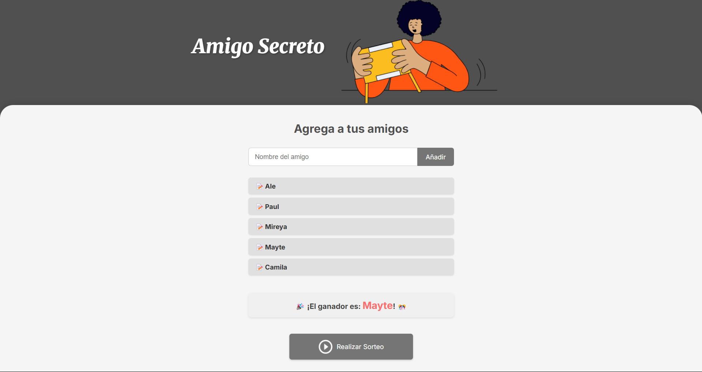
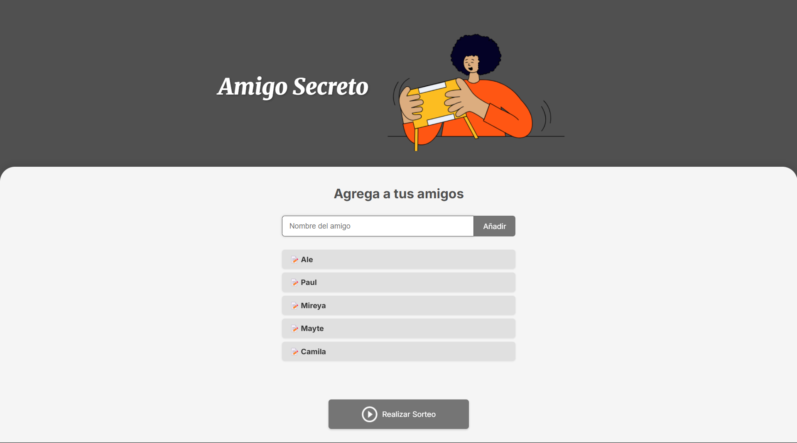
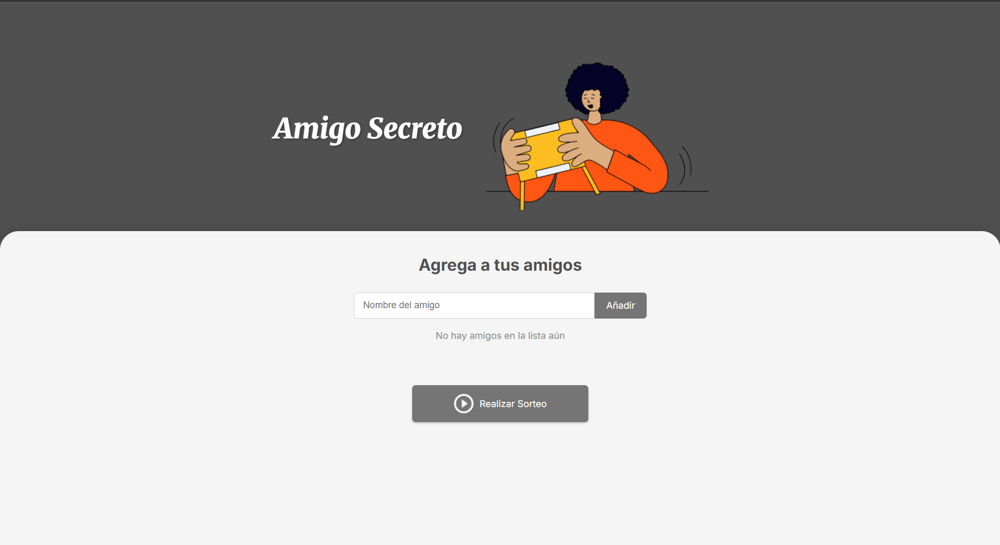

# 🎲 Challenge Amigo Secreto

<div align="center">
  
  <br><br>
  <p><b>Una aplicación web simple y elegante para realizar sorteos aleatorios entre amigos</b></p>
  <p>
    
    
    
  </p>
</div>

## ✨ Características

- **📝 Agregar Amigos:** Interfaz intuitiva para añadir nombres a la lista
- **✅ Validación de Entradas:** Previene nombres duplicados o campos vacíos
- **👥 Lista Visual:** Muestra todos los participantes agregados
- **🎯 Sorteo Aleatorio:** Selecciona un ganador al azar entre los participantes
- **⌨️ Soporte para Teclado:** Permite agregar nombres presionando Enter
- **💬 Mensajes Informativos:** Proporciona feedback claro al usuario

## 📸 Capturas de Pantalla

<div align="center">
  <table>
    <tr>
      <td align="center">
        
        <br>
        <em>Pantalla principal</em>
      </td>
      <td align="center">
        
        <br>
        <em>Lista de participantes</em>
      </td>
      <td align="center">
        
        <br>
        <em>Resultado del sorteo</em>
      </td>
    </tr>
  </table>
</div>

## 🛠️ Tecnologías Utilizadas

- **HTML5:** Estructura semántica para la aplicación
- **CSS3:** Estilos modernos con variables CSS para una apariencia limpia
- **JavaScript:** Funcionalidades dinámicas para gestionar la lista y realizar el sorteo
- **Fuentes de Google:** Familia de fuentes Inter y Merriweather para una mejor tipografía

## 📥 Instalación

1. Clona este repositorio:
   ```bash
   git clone https://github.com/tu-usuario/amigo-secreto.git
   ```

2. Navega al directorio del proyecto:
   ```bash
   cd amigo-secreto
   ```

3. Abre el archivo `index.html` en tu navegador favorito.

## 📋 Uso

1. **Agregar Amigos:**
   - Escribe el nombre en el campo de texto
   - Presiona el botón "Añadir" o la tecla Enter

2. **Realizar el Sorteo:**
   - Una vez que hayas agregado al menos dos nombres, haz clic en "Realizar Sorteo"
   - El nombre del ganador aparecerá destacado debajo

3. **Consejos:**
   - No puedes agregar nombres duplicados
   - Necesitas al menos dos participantes para realizar un sorteo

## 📁 Estructura del Proyecto

```
amigo-secreto/
│
├── index.html          # Estructura HTML principal
├── style.css           # Estilos CSS
├── app.js              # Lógica JavaScript
└── assets/             # Imágenes 
    ├── amigo-secreto.png
    └── play_circle_outline.png
```

## 🤝 Contribuciones

Las contribuciones son bienvenidas. Para cambios importantes:

1. Primero discute los cambios que deseas realizar a través de un issue
2. Realiza un fork del proyecto
3. Crea una rama para tu función (`git checkout -b feature/nueva-funcion`)
4. Realiza tus cambios y haz commit (`git commit -m 'Añadir nueva función'`)
5. Sube los cambios a tu fork (`git push origin feature/nueva-funcion`)
6. Abre un Pull Request


<div align="center">
  <p>Desarrollado con ❤️ para compartir y aprender</p>
</div>